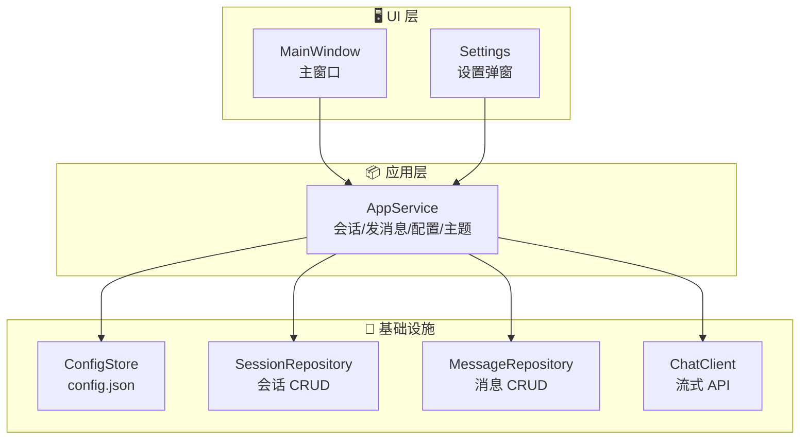
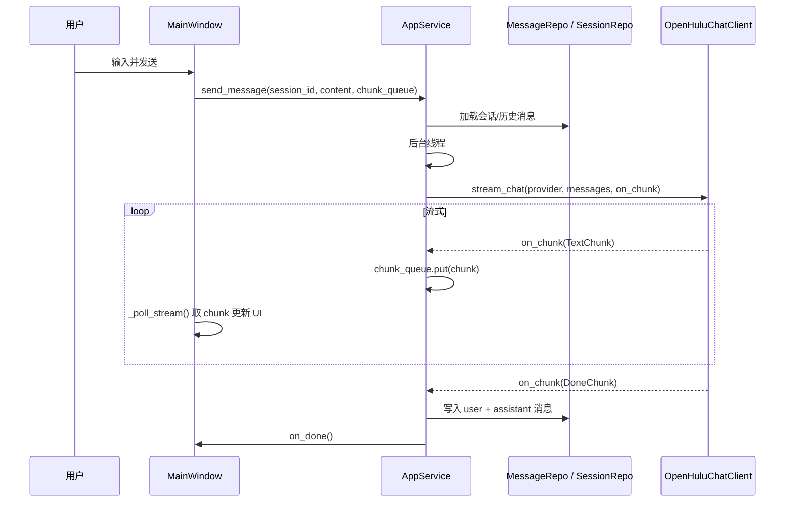
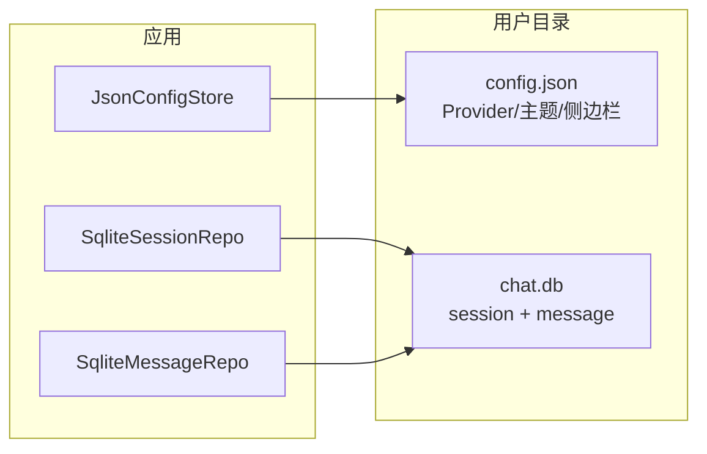

# 🍵 HuluChat

> 轻量桌面 AI 聊天应用：多模型切换、流式对话、本地历史、可打包分发。  
> [English](README_EN.md) | 中文

---

## 📑 目录

- [🍵 HuluChat](#-huluchat)
  - [📑 目录](#-目录)
  - [✨ 特性](#-特性)
  - [🏗️ 项目结构](#️-项目结构)
  - [📐 架构与流程](#-架构与流程)
    - [整体架构](#整体架构)
    - [发送消息流程（流式）](#发送消息流程流式)
    - [数据与配置流向](#数据与配置流向)
  - [🚀 快速开始](#-快速开始)
    - [环境要求](#环境要求)
    - [运行开发环境](#运行开发环境)
  - [📦 打包分发](#-打包分发)
  - [📂 配置与数据](#-配置与数据)
  - [🔮 未来计划](#-未来计划)
  - [📋 更新日志](#-更新日志)
  - [📄 许可证](#-许可证)

---

## ✨ 特性

- **多模型接入与切换**：支持任意 OpenAI 兼容 API（Base URL + API Key + Model ID），可配置多个 Provider 并随时切换。
- **流式对话**：回复逐字输出，体验更流畅。
- **本地持久化**：会话与消息存储在本地 SQLite，隐私可控。
- **主题与布局**：亮色/暗色主题，侧边栏可折叠。
- **可分发 exe**：支持 PyInstaller 打包为 Windows 单文件 exe，配置与数据仍存用户目录。

---

## 🏗️ 项目结构

```
HuluChat/
├── main.py                 # 🚪 启动入口（供直接运行与 PyInstaller 使用）
├── requirements.txt        # 📋 Python 依赖
├── HuluChat.spec           # 📦 PyInstaller 打包配置
├── LICENSE                 # 📄 许可证
│
├── src/                    # 应用源码
│   ├── main.py             # 应用入口：组装 Config / Persistence / Chat / AppService / UI
│   ├── app_data.py         # 应用数据目录（跨平台路径：APPDATA / XDG / Library）
│   ├── logging_config.py   # 日志配置
│   │
│   ├── app/                # 应用/用例层
│   │   └── service.py      # AppService：编排发消息、会话、配置、主题（不依赖 UI）
│   │
│   ├── chat/               # 对话层
│   │   ├── client.py       # ChatClient 抽象、StreamChunk/TextChunk/DoneChunk/ChatError
│   │   └── openai_client.py # OpenAI 兼容流式实现（OpenHuluChatClient）
│   │
│   ├── config/             # 配置层
│   │   ├── models.py       # AppConfig、Provider、序列化
│   │   └── store.py        # ConfigStore 抽象与 JsonConfigStore 实现
│   │
│   ├── persistence/        # 持久化层
│   │   ├── db.py           # SQLite 初始化与建表（session / message）
│   │   ├── models.py       # Session、Message 数据模型
│   │   ├── session_repo.py # 会话 CRUD
│   │   └── message_repo.py # 消息追加与按会话查询
│   │
│   └── ui/                 # 界面层
│       ├── main_window.py  # 主窗口：侧边栏、对话区、输入区、模型切换、设置入口
│       ├── settings.py     # 设置弹窗：Provider 列表、主题、侧边栏状态
│       ├── settings_validation.py  # 名称/URL/Model/API Key 校验
│       └── settings_constants.py   # 设置界面常量
│
├── .cursor/                # Cursor 编辑器相关（规则、技能等），可忽略
└── openspec/               # OpenSpec 规范与变更（设计/任务等），可忽略
```

- **根目录**：`main.py` 为入口；`requirements.txt`、`HuluChat.spec` 用于依赖与打包。
- **src**：核心逻辑与 UI。`app` 负责用例编排，`chat` 负责流式 API 调用，`config`/`persistence` 负责配置与数据库，`ui` 负责 CustomTkinter 界面。

---

## 📐 架构与流程

### 整体架构



### 发送消息流程（流式）



### 数据与配置流向



---

## 🚀 快速开始

### 环境要求

- Python 3.10+
- 依赖：`customtkinter`、`openai`（见 `requirements.txt`）

### 运行开发环境

1. **安装依赖**

   ```bash
   pip install -r requirements.txt
   ```

2. **启动应用**

   ```bash
   python main.py
   ```

   或：

   ```bash
   python -m src.main
   ```

3. **首次使用**：未配置任何 Provider 时，请在「设置」中添加模型（Base URL、API Key、Model ID）后再发送消息。

---

## 📦 打包分发

打包为 Windows 单文件 exe：

1. 安装 PyInstaller：

   ```bash
   pip install pyinstaller
   ```

2. 在项目根目录执行：

   ```bash
   pyinstaller HuluChat.spec
   ```

3. 生成的可执行文件在 `dist/HuluChat.exe`。运行 exe 时，配置与数据库仍使用用户目录，不写入 exe 所在目录。

---

## 📂 配置与数据

应用使用**应用数据根目录**存放配置与 SQLite 数据库，不依赖进程当前工作目录：

| 系统 | 路径 |
|------|------|
| **Windows** | `%APPDATA%/HuluChat` |
| **Linux** | `$XDG_CONFIG_HOME/HuluChat` 或 `~/.config/HuluChat` |
| **macOS** | `~/Library/Application Support/HuluChat` |

目录内文件：

- `config.json`：Provider 列表、当前模型、主题、侧边栏展开状态
- `chat.db`：会话与消息 SQLite 数据库

首次运行时会自动创建该目录。

---

## 🔮 未来计划

- **图片上传与多模态**：支持在对话中上传图片，调用视觉模型（如 GPT-4V）进行分析与回复。
- **更多输入方式**：语音输入、从文件/剪贴板粘贴大段文本等。
- **导出与备份**：将会话/消息导出为 Markdown 或 JSON，便于备份与迁移。
- **快捷键与可访问性**：全局快捷键、高对比度与字体大小设置。
- **插件或扩展**：预留扩展点，便于接入自定义工具或第三方 API。

欢迎提 Issue 或 PR 一起完善。

---

## 📋 更新日志

功能变更与修复见 [docs/changlog.md](docs/changlog.md)。

---

## 📄 许可证

见 [LICENSE](LICENSE)。

---

<p align="center">
  <sub>🍵 HuluChat — 轻量、本地、可打包的桌面 AI 聊天</sub>
</p>
