# 🍵 HuluChat

> A lightweight desktop AI chat app: multi-model switching, streaming replies, local history, and distributable builds.  
> English | [中文](README.md)

---

## 📑 Table of Contents

- [🍵 HuluChat](#-huluchat)
  - [📑 Table of Contents](#-table-of-contents)
  - [✨ Features](#-features)
  - [🏗️ Project Structure](#️-project-structure)
  - [📐 Architecture](#-architecture)
    - [High-level](#high-level)
    - [Send message (streaming)](#send-message-streaming)
    - [Data \& config](#data--config)
  - [🚀 Quick Start](#-quick-start)
    - [Requirements](#requirements)
    - [Run](#run)
  - [📦 Build \& Distribute](#-build--distribute)
  - [📂 Config \& Data](#-config--data)
  - [🔮 Roadmap](#-roadmap)
  - [📄 License](#-license)

---

## ✨ Features

- **Multi-model support**: Add multiple OpenAI-compatible providers (Base URL, API Key, Model ID) and switch between them.
- **Streaming chat**: Replies stream token-by-token for a smooth experience.
- **Local persistence**: Sessions and messages stored in SQLite on your machine.
- **Theme & layout**: Light/dark theme; collapsible sidebar.
- **Distributable exe**: PyInstaller build for Windows; config and data stay in user directories.

---

## 🏗️ Project Structure

```
HuluChat/
├── main.py                 # 🚪 Entry point (run & PyInstaller)
├── requirements.txt        # 📋 Python dependencies
├── HuluChat.spec           # 📦 PyInstaller spec
├── LICENSE                 # 📄 License
│
├── src/                    # Application source
│   ├── main.py             # Wiring: Config, Persistence, Chat, AppService, UI
│   ├── app_data.py         # App data dir (APPDATA / XDG / Library)
│   ├── logging_config.py   # Logging setup
│   │
│   ├── app/                # Application / use-case layer
│   │   └── service.py      # AppService: send message, sessions, config, theme
│   │
│   ├── chat/               # Chat layer
│   │   ├── client.py       # ChatClient abstraction, StreamChunk types
│   │   └── openai_client.py # OpenAI-compatible streaming (OpenHuluChatClient)
│   │
│   ├── config/             # Config layer
│   │   ├── models.py       # AppConfig, Provider, serialization
│   │   └── store.py       # ConfigStore + JsonConfigStore
│   │
│   ├── persistence/        # Persistence layer
│   │   ├── db.py           # SQLite init & tables (session, message)
│   │   ├── models.py       # Session, Message models
│   │   ├── session_repo.py # Session CRUD
│   │   └── message_repo.py # Message append & list by session
│   │
│   └── ui/                 # UI layer
│       ├── main_window.py  # Main window: sidebar, chat area, input, model selector
│       ├── settings.py     # Settings dialog: providers, theme, sidebar
│       ├── settings_validation.py  # Validation for name/URL/model/API key
│       └── settings_constants.py   # UI constants
│
├── .cursor/                # Cursor editor (rules, skills); optional
└── openspec/               # OpenSpec specs & changes; optional
```

- **Root**: `main.py` is the entry; `requirements.txt` and `HuluChat.spec` for deps and packaging.
- **src**: Core logic and UI. `app` orchestrates use cases; `chat` handles streaming API; `config`/`persistence` handle config and DB; `ui` is CustomTkinter.

---

## 📐 Architecture

### High-level

```mermaid
flowchart TB
    subgraph UI["🖥️ UI Layer"]
        MainWindow["MainWindow"]
        Settings["Settings"]
    end

    subgraph App["📦 App Layer"]
        AppService["AppService"]
    end

    subgraph Infra["🔧 Infrastructure"]
        ConfigStore["ConfigStore"]
        SessionRepo["SessionRepository"]
        MessageRepo["MessageRepository"]
        ChatClient["ChatClient"]
    end

    MainWindow --> AppService
    Settings --> AppService
    AppService --> ConfigStore
    AppService --> SessionRepo
    AppService --> MessageRepo
    AppService --> ChatClient
```



### Send message (streaming)


### Data & config


---

## 🚀 Quick Start

### Requirements

- Python 3.10+
- Dependencies: `customtkinter`, `openai` (see `requirements.txt`)

### Run

1. **Install**

   ```bash
   pip install -r requirements.txt
   ```

2. **Start**

   ```bash
   python main.py
   ```

   or:

   ```bash
   python -m src.main
   ```

3. **First run**: If no provider is configured, open **Settings** and add a model (Base URL, API Key, Model ID), then send a message.

---

## 📦 Build & Distribute

To build a Windows exe:

1. Install PyInstaller:

   ```bash
   pip install pyinstaller
   ```

2. From project root:

   ```bash
   pyinstaller HuluChat.spec
   ```

3. Output: `dist/HuluChat.exe`. Config and database still use the user directory, not the exe folder.

---

## 📂 Config & Data

Config and SQLite DB are stored in an **app data root**, independent of process cwd:

| OS | Path |
|----|------|
| **Windows** | `%APPDATA%/HuluChat` |
| **Linux** | `$XDG_CONFIG_HOME/HuluChat` or `~/.config/HuluChat` |
| **macOS** | `~/Library/Application Support/HuluChat` |

Contents:

- `config.json`: Providers, current model, theme, sidebar state
- `chat.db`: Sessions and messages (SQLite)

The directory is created on first run.

---

## 🔮 Roadmap

- **Image upload & vision**: Attach images in chat and use vision models (e.g. GPT-4V).
- **More input**: Voice input, paste from file/clipboard.
- **Export & backup**: Export sessions/messages to Markdown or JSON.
- **Shortcuts & accessibility**: Global shortcuts, contrast and font size options.
- **Extensions**: Hooks for custom tools or third-party APIs.

Issues and PRs welcome.

---

## 📄 License

See [LICENSE](LICENSE).

---

<p align="center">
  <sub>🍵 HuluChat — Lightweight, local, packable desktop AI chat</sub>
</p>
